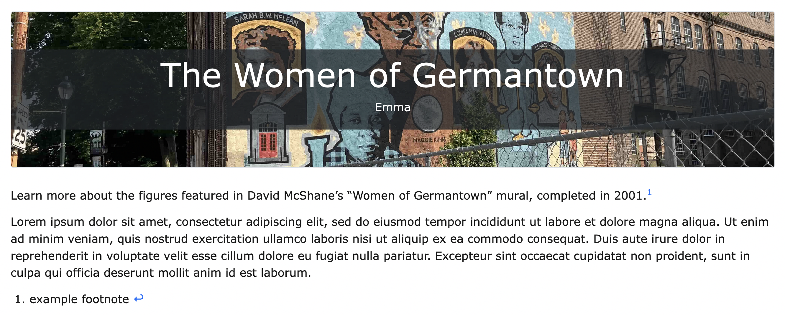

# Adding Content
Most of the content being added to the site will be files for the [exhibits page](../pages/exhibits.md). Every md (shorthand for [Markdown](https://www.markdownguide.org/getting-started/)) file has two parts: the front matter and the content.


[Front matter](https://jekyllrb.com/docs/front-matter/) is a list of [YAML](https://yaml.org/)variables at the top of a page. YAML is a configuration langugage. It's an essential part of Jekyll's structure.


Front matter is indicated with a starting `---` and a closing `---`. For example, here's the front matter of the archive page
```
---
title: archive
layout: browse
permalink: browse.html
---
```


Title and layout are essential variables for new pages. If you don't need any special styling, the layout should be default. Checkout the [advanced documentation](advanced.md) for more on layouts. Permalink is also important here: it's specifies the location of the page. 

A permalink can be internal (ex. _posts/exhibits.md) or external (ex. https://digbmc.github.io/germantown-y/exhibits.html). The permalink in the front matter should be internal (title + .html) because Jekyll generates the external permalink. Keep it short, and similar to the title of the file. 


## Creating pages
If you need to create a page outside of Exhibits, create a markdown file in the _posts folder. The naming convention for pages is lowercase with dashes between words.

For example, if I wanted to create an exhibit about the pool, I could call it "germantown-pool.md"

For more on creating exhbit pages checkout the documentation om [exhbit creation](exhbit-creation.md)

## Working on existing pages
Exhibit files can be found in the _exhibts folder, the rest of the pages are in _posts. To edit the content of the page, edit the content underneath the front matter. (Visit [editing files](https://docs.github.com/en/repositories/working-with-files/managing-files/editing-files) for more information on GitHub's editing mode) Everything in that section of the file will be pulled when the site generates content.


### Text
To add content to a given page, start writing below the page's front matter. All text should be written using markdown, a simple formatting language.


[Guide to Markdown](https://www.markdownguide.org/basic-syntax/)


### Features
Features are snippets of code that can be added to pages with a single line. CollectionBuilder has several features designed to make adding content easier. They're a great tool for adding visual content, especially from the archive.


#### Images
to add images to a page, add this line of code to your markdown file: ``


Objectid is a parameter: here you would put the image you want to use. This can either be an objectid from the meta data, a url to an external image, or a relative link to a picture in the assets folder. Replace "demo_001" with the source of your image.


Parameters allow you to customize the way the feature loads.


Other parameters include...


- alt = alternative text describing the image, essential for screen readers
- caption = if you don't add a caption, and you use an object id, the caption below the image  vwill be the description from the metadata. use the caption tag if you want a custom caption, or add `caption:false` to remove it
- link = if you want to change the link that the image goes to when you click on the image. If you don't include the link parameter the url will automatically be the image source
 - width = will use responsive sizing to set the % size on desktop (will be 100% on mobile), choose from "25", "50", "75", or "100" (optional)

For example, if I wanted to add an image with a caption ``
#### PDFs
You can include a pdf with ``


Like with the image feature, the objectid can be an objectid, a link to an external pdf, or a link to an internal pdf.


Additional Parameters:
- caption
- width
- ratio: change the size of the pdf by changing the ratio. options are "21x9", "16x9", "4x3", or "1x1". 1x1 is the default.

If I wanted to add a pdf and change the ratio to "16x9", I would add the code ``

#### More features
Check out CollectionBuilder's [Feature Bonanza](https://collectionbuilder.github.io/collectionbuilder-gh/feature_options.html) for more information on features.


### Footnotes:
With the use of [Kramdown](https://kramdown.gettalong.org/) footnotes are easy to add to markdown documents.

A good example of footnotes can be found on [this exhbit example page](_exhibits/example-1.md)


```
Learn more about the figures featured in David McShane's "Women of Germantown" mural, completed in 2001.[^fn1]


Lorem ipsum dolor sit amet, consectetur adipiscing elit, sed do eiusmod tempor incididunt ut labore et dolore magna aliqua. Ut enim ad minim veniam, quis nostrud exercitation ullamco laboris nisi ut aliquip ex ea commodo consequat. Duis aute irure dolor in reprehenderit in voluptate velit esse cillum dolore eu fugiat nulla pariatur. Excepteur sint occaecat cupidatat non proident, sunt in culpa qui officia deserunt mollit anim id est laborum.


[^fn1]: example footnote
```
On the site, it looks like this:



 For more information, checkout the documentation on [adding footnotes](https://minicomp.github.io/ed/documentation/#footnotes)


