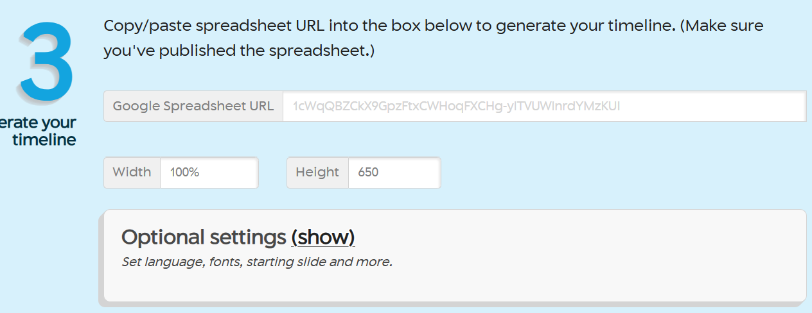

# TimelineJS
Start off by using TimelineJS to download the spreadsheet. TimelineJS is an open-source tool that enables anyone to build visually rich, interactive timelines. To creat a timeline, you can simply use a Google Spreadsheet.

Here is the site to get you started 
[TimelineJS Website URL](https://timeline.knightlab.com/)

TimelineJS has documentation which you can find here [TimelineJS Documentation](https://timeline.knightlab.com/docs/using-spreadsheets.html)

# Working with Spreadsheet: Additional Customization Tips
## Dates 
- Only use numbers 
- To use words like 'January', input text into the Display Date column

## Text styling 
- To change the color of the text, input html elements such as 
```
<span style="color: blue;">Text</span>
```
This will change the text color to blue
- To bold text use:
`<strong>text</strong>`

## Images 
- For adding images always use the image url and copy/paste it into the "Media column"
- To input background image, copy the image url into the "Background column"

## Background color 
input the color in words or use a CSS hex color. For example, inputting “lightblue” or #8BB1C4. Don’t forget the pound/hashtag sign '#' when inputting a hex color

In the end, here is what your timeline spreadsheet should look like with all the different elements 

## Organizing 
Using the group colummn, you can organize the slides by groups (tags). These tags will group events together and sort them into the same category. For example, the timeline displayed has 4 groups: Building, Damage, Redevelopment, and Pool. On the timeline, events with the same group will be put in the same row.

## After working with the spreadsheet
- publish your timeline under the file menu in the spreadsheet
- click share and publish
- copy and paste the URL to timeline js website

## Changing Font 
click on the "show" next to 'Optional Settings'  and there will display the different types of fonts

# How to Input the Timeline into the Site
In the history html file, the first line of code is a container div with an embedded iframe displaying content from an external source, which in this case is the timeline. From the timeline js site, step 4, copy and paste the URL provided under the 'Embed' title. Then it'll look like this
```
<div class = "container">
    <iframe src='https://cdn.knightlab.com/libs/timeline3/latest/embed/index.html?source=1cY9J-XJMjoE2zsrY107C04k1gsyULF2o-maf0OON_-w&font=Default&lang=en&initial_zoom=2&height=650' width='100%' height='650' webkitallowfullscreen mozallowfullscreen allowfullscreen frameborder='0'></iframe>
</div>
```
