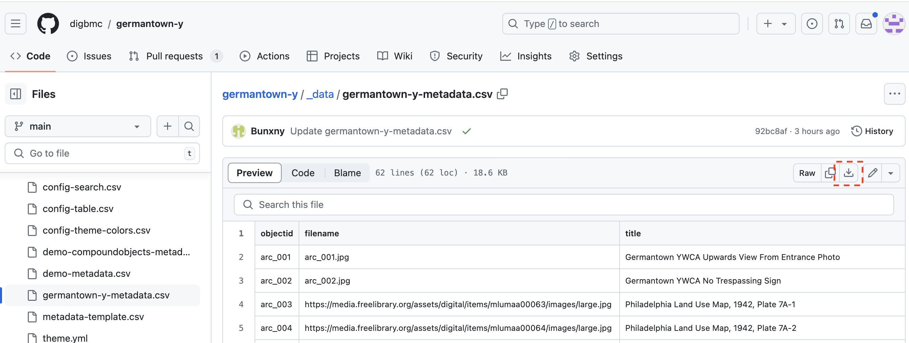

<!-- ToDo: 
- Add images!! with instructions
- Fix image link(done)
- Write instructions on how to download csv, then import to google sheets, then reupload once modified
- Elaborate advanced customization
- Add code snippets-->
# Webmap Documentation

## Table of Contents
- Prerequisites
- Adding Items to Map
- Advanced Customization

## Prerequisites
This tutorial assumes that you have already cloned the repository and you are working on your own branch. If you have not done so, go to https://github.com/digbmc/germantown-y/docs/background-info.md and follow the instructions before beginning this tutorial.

## Adding Items to the Map:
The webmap pulls data from the file: germantown-y-metadata.csv located in the _data folder. You can modify, remove or add items to the map by modifying this file. This tutorial will demonstrate two ways through which to achieve this:

### Using GitHub Web Interface:
Navigate to _data/germantown-y-metadata.csv. 
Download the file using the download button:

Import the file in google sheets. Make your edits. To make sure the item displays on the map it must contain a latitude, a longitude and a subject. The pop ups will only appear in the map if there is a title, description and date associated with the item. The item will be categorised according to subject, and displayed on the map with the marker color according to the category it is assigned. 
### Using VS Code:

## Advanced Customization:
The map was created using LeafletJS. You will need some knowledge of HTML, CSS and functional programming in JavaScript to make additional changes. If you are not sure how this works, its best to leave the map as is.

Here are some resources to get you started:

HTML: https://developer.mozilla.org/en-US/docs/Web/HTML

CSS: https://developer.mozilla.org/en-US/docs/Web/CSS

LeafletJS: https://leafletjs.com/reference.html

JavaScript: https://developer.mozilla.org/en-US/docs/Web/JavaScript

Go to pages/webmap-js.html in the repository to make additional changes to the map.

### Modify Icon Colors:
Within the style tags, each category has its own color for marker icon. Change the value in hue rotate to change these colors. This applies styling to the default icon image in the leaflet library. Since this is an image, image styling css can be applied to modify how these icons appear.

### Modify Layers Dispalyed Upon Page Load
If a layer has .addTo(map), it will be displayed on page load. 
### Add Additional Base Layers
Free base layers: (link)
WMS layers vs WMTS layers

### Modify Pop Ups
Edit the function createLayer

### Modify Categories
Edit the conditional statement in the function addDataToLayer

