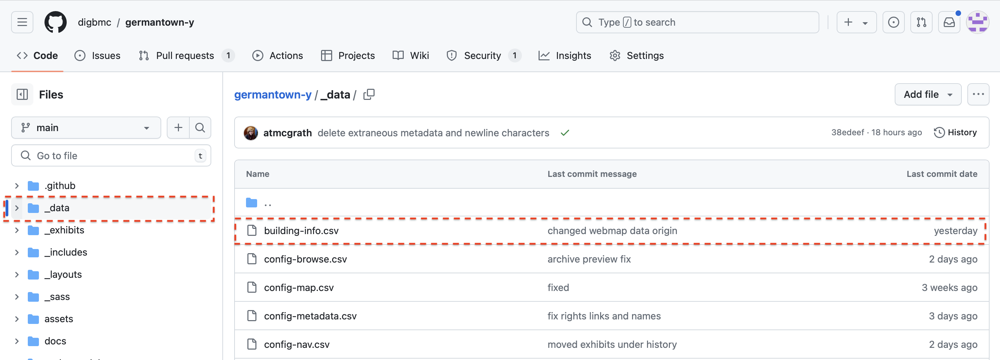
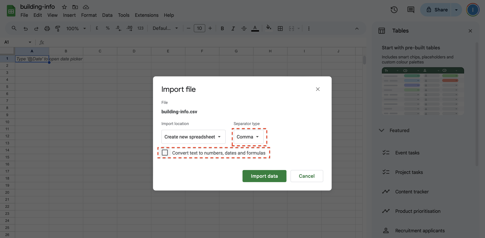

<!-- ToDo: 
- Add images!! with instructions
- Write instructions on how to edit the csv and reupload once modified
- Elaborate advanced customization
- Add code snippets-->
# Webmap Documentation

## Table of Contents
- Prerequisites
- Useful Vocab
- Adding Items to Map
- Advanced Customization

## Prerequisites
This tutorial assumes that you have already cloned the repository and you are working on your own branch. If you have not done so, go to the [Getting Started](https://github.com/digbmc/germantown-y/docs/background-info.md) page and follow the instructions before beginning this tutorial.

You will also need a google account to add more content to the map:
-   [Create a Google Account](https://support.google.com/accounts/answer/27441?hl=en). You will need to use Google Sheets to edit a file.
## Useful Vocab:
- CSV: Comma seaprated file, this can also be viewed as a table.
- Markers: The exact point of a location on the map
- Pop-ups: The dialoague boxes that appear when you click on a marker
## Adding Items to the Map:
The webmap pulls data from the file: building-info.csv located in the _data folder. You can modify, remove or add items to the map by modifying this file. This tutorial will demonstrate how to achieve this:

### Using GitHub Web Interface:
Log in to github and go to the [Germantown-Y github repository](https://github.com/digbmc/germantown-y). Switch to your branch from the dropdown:

Once you are in your branch, navigate to _data/building-info.csv. 

Open the file and download it using the download button:

Go to [Google Sheets](https://docs.google.com/spreadsheets/u/0/). 
Import the file in google sheets by going to File > Import your file. 

In the popup that appears, go to the upload tab. Click on Browse, go to your downloads folders, or where the file is saved and upload it. Alternatively you can also drag and drop it in the upload tab.  

Select comma as the separator type and uncheck the convert text to numbers, dates and formulas box. Click on import data.

The sheet has the following columns: id, title, creator, date, description, subject, location, latitude, longitude, , sourceobject_location, image_alt_text. 
- **ID:** The unique id associated with each item in the map. It is good practice to add them if you add a new location.
- **Title:** The title or name of the location. If you want a pop-up to show on the marker, this field is necessary.
- **Creater:** The name of the person who created the item in the csv
- **Date:** The date or year the building or location was established. Currently, most of these locations have a have a the established year associated with them in the csv, this is so the user has an idea of what time period that location or building was founded in. If you want a pop-up to show on the marker, this field is necessary.
- **Description:** A description of what the locartion is, how it is significant to the Germantown YWCA and any additional information that the user may be interested in. If you modify these, we suggest you also add the source of where you got that information from and put it under sources in the csv. This field is necessary for the pop-up.
- **Subject:** How the locations are grouped together in the map. The subjects appear in the side bar on the top right and are color coded. For an object to appear on the map, this must not be left blank.
- **Location:** The address of the location. If you want a pop-up to show on the marker, this field is necessary.
- **Latitude:** The latitde coordianate of the item. For a marker to show up on the map, this is necessary.
- **Longitude:** The longitude coordianate of the item. For a marker to show up on the map, this is necessary.
- **Source:** The source of the information int he description field
- **Object Location:** If an image is used from within the repository, then the relative url of the image. Complete url if image is not already present within the repository.
- **Image Alt Text:** Alternative text for the image used for accessibility 

Make your edits. To make sure the item displays on the map it must contain a latitude, a longitude and a subject. The pop ups will only appear in the map if there is a title,   description and date associated with the item. The item will be categorised according to subject and displayed on the map with the marker color according to the subject it is assigned. 

Adding image to pop-up:
- If already present in the collection:
- If uploading a new one:

Save as a csv. Open in a text editer, select all, copy. Go to _data, select all, paste. Save the file. Open a pull request for your edits to show on the website.
## Advanced Customization:
The map was created using LeafletJS. You will need some knowledge of HTML, CSS and functional programming in JavaScript to make additional changes. If you are not sure how this works, it might be helpful to fork the repository and make changes separately.

Here are some resources to get you started:

HTML: https://developer.mozilla.org/en-US/docs/Web/HTML

CSS: https://developer.mozilla.org/en-US/docs/Web/CSS

LeafletJS: https://leafletjs.com/reference.html

JavaScript: https://developer.mozilla.org/en-US/docs/Web/JavaScript

Go to pages/webmap-js.html in the repository to make additional changes to the map.

### Modify Icon Colors:
Within the style tags, each category has its own color for marker icon. Change the value in hue rotate to change these colors. This applies styling to the default icon image in the leaflet library. Since this is an image, image styling css can be applied to modify how these icons appear.

### Modify Layers Dispalyed Upon Page Load
If a layer has .addTo(map), it will be displayed on page load. The page loads top doen, so the last thing in the code will appear on top on your webpage.
### Add Additional Base Layers
Free base layers: (link)
WMS layers vs WMTS layers and how to add them. Leaflet only allows image tiles.

### Modify Pop Ups
Edit the function createLayer

### Modify Categories
Edit the conditional statement in the function addDataToLayer

