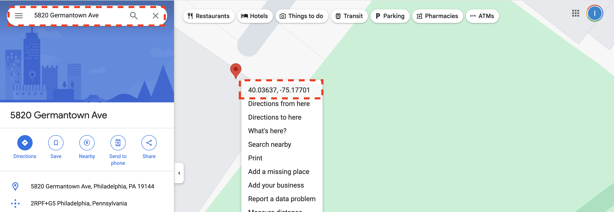
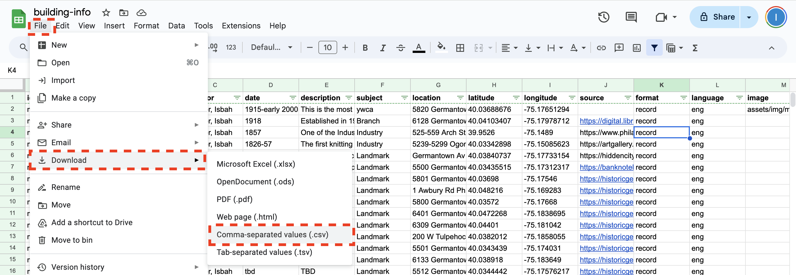
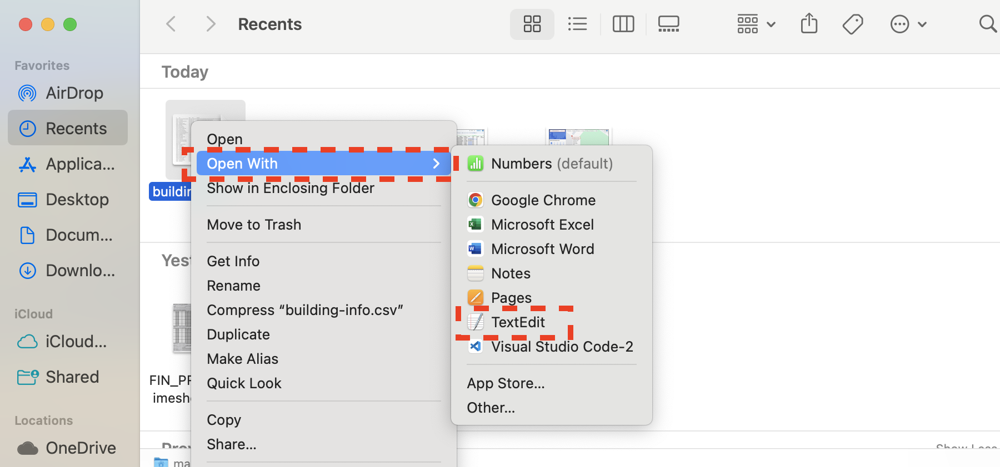
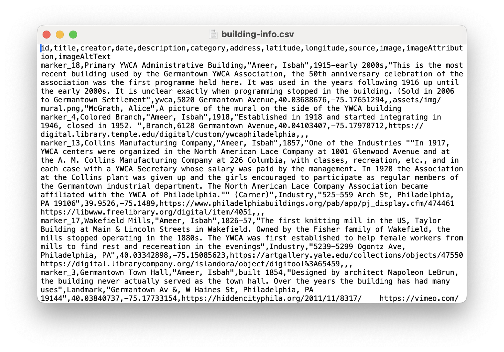

# Webmap Documentation

## Table of Contents
- [Prerequisites](#prerequisites)
- [Useful Vocab](#useful-vocab)
- [Adding Items to Map](#adding-items-to-the-map)
- [Troubleshooting](#troubleshooting)
- [Advanced Customization](#advanced-customization)

## Prerequisites
This tutorial assumes that you are working on your own branch. If you have not set this up, go to the [Getting Started](https://github.com/digbmc/germantown-y/docs/background-info.md) page and follow the instructions before beginning this tutorial.
<!-- "Getting Started" link does not work -->
You will also need a Google account to add more content to the map:
-   [Create a Google Account](https://support.google.com/accounts/answer/27441?hl=en). You will need to use Google Sheets to edit a file.
## Useful Vocab:
- CSV: Comma Separated Values file; this can also be viewed as a table.
- Markers: The exact point of a location on the map.
- Pop-ups: The dialogue boxes that appear when you click on a marker.
- Text editor: A tool that lets you work directly with plain text files.
## Adding Items to the Map:
The map uses data from the file: building-info.csv located in the _data folder. You can modify, remove or add items to the map by modifying this file. This tutorial will demonstrate how to achieve this:

### Using GitHub Web Interface:
Log in to GitHub and go to the [Germantown-Y github repository](https://github.com/digbmc/germantown-y). Switch to your branch from the dropdown:


Once you are in your branch, navigate to _data/building-info.csv.


Open the file and download it using the download button:


Go to [Google Sheets](https://docs.google.com/spreadsheets/u/0/).
Import the file in Google Sheets by going to File > Import your file.


In the popup that appears, go to the upload tab. Click on Browse, go to your downloads folders, or where the file is saved, and upload it. Alternatively, you can also drag and drop it in the upload tab.


Select comma as the separator type and uncheck the convert text to numbers, dates, and formulas box. Click on import data.

The sheet has the following columns: id, title, creator, date, description, category, address, latitude, longitude, source, image, imageAttribution, imageAltText
- **ID:** The unique id associated with each item in the map. It is good practice to add them if you add a new location.
- **Title:** The title or name of the location. If you want a pop-up to show on the marker, this field is necessary.
- **Creator:** The name of the person who created the item in the CSV
- **Date:** The date or year the building was established. Currently, most of these locations have the established year associated with them in the CSV, this is so the user has an idea of what period that location or building was founded in. If you want a pop-up to show on the marker, this field is necessary.
- **Description:** A description of what the location is, how it is significant to the Germantown YWCA, and any additional information the user may be interested in. If you modify these, I suggest you add the source of where you got that information from and put it under sources in the CSV. This field is necessary for the pop-up.
- **Category:** How the locations are grouped together on the map. The categories appear in the sidebar on the top right and are color-coded. For an item to appear on the map, this must not be left blank.
- **Address:** The address of the location. If you want a pop-up to show on the marker, this field is necessary.
- **Latitude:** The latitude coordinate of the item. For a marker to show up on the map, this is necessary.
- **Longitude:** The longitude coordinate of the item. For a marker to show up on the map, this is necessary.
- **Source:** The source of the information in the description field.
- **Image:** The path to the image file you want to display on the pop-up.
- **Image Attribution:** The source of the image.
- **Image Alt Text:** Alternative text for the image should be put here. Alt text is used by screen readers to describe the image and helps make the website more accessible.


Make your edits. To ensure the item displays on the map it must contain a latitude, a longitude, and a category. One way to get the latitude and longitude of an item is to look up the address of the item in Google Maps, right-click on the map and the latitude and longitude will pop up. For example, to find the latitude and longitude of the Primary Administrative YWCA Building, look up its address in Google Maps. In this case, the address is 5820, Germantown Avenue:


Copy and paste them into the building-info sheet in the respective fields. The first number is the latitude and the second is the longitude.

The pop-ups will only appear on the map if there is a **title**, **description**, and the **date** associated with the item. The item will be categorized according to the category column and displayed on the map with the icon color according to the category it is assigned. You can choose to assign an existing category to the item or add a new category. If a new category is assigned it will show up in the sidebar, and the color of the icon for that category will be random. To change its color, [advanced customization](#advanced-customization) is required.

#### Adding an image to pop-up:
- **If using an image that is already present in the collection:**
add a relative path linking to that image in the image field. Such as
```
assets/img/mural.png
```
- **If using a new image:** ensure you have permission to use the image you are using. You can add the image URL in the image field, with appropriate attribution and alt text. If you want to add a new image to the collection and then use that image so that it shows up in the archive and the pop-up on the map, go to [Metadata Documentation](docs/metadata-docs.md)

Make sure to add the appropriate attribution and alt text for the image in the imageAttribution and imageAltText fields.


### Adding changes to the repository:
Save as a CSV.

Locate the saved CSV file, and open it in a text editor.


This is what the file looks like in a text editor:



In the file, select all: `CMD + A` on your keyboard on a Mac or `CTRL + A` on a Windows computer. Copy: `CMD + C` on Mac or `CTRL + C` on Windows or right-clicking on your mouse and choosing copy. In a browser, go to the repository. Navigate to your branch, and go to: _data/building-info.csv. Click the edit button in the top right corner. Select all, and paste: `CMD + V` on Mac or `CTRL + V` on Windows or right-clicking and choosing paste from the drop-down. Click on commit changes once you are ready to display your changes, add your commit message in the pop-up, and choose which branch you want to commit your changes to.

[Create a pull request](https://docs.github.com/en/pull-requests/collaborating-with-pull-requests/proposing-changes-to-your-work-with-pull-requests/creating-a-pull-request) for your edits to show on the website.


## Troubleshooting:
If an item in the CSV is not showing up on the map, make sure the required fields contain some data and are not empty. You can also right click on the webpage, and click on inspect. Go to the console tab to see any errors. An error message stating:
```
Feature missing required fields: (category, latitude, or longitude)
```
will show up in the console indicating which required field was left blank.


## Advanced Customization:
The map was created using LeafletJS. You will need some knowledge of HTML, CSS and functional programming in JavaScript to make additional changes. If you are not sure how this works, it might be helpful to [fork the repository](https://docs.github.com/en/pull-requests/collaborating-with-pull-requests/working-with-forks/fork-a-repo) and make changes separately.

Here are some resources to get you started:

HTML: https://developer.mozilla.org/en-US/docs/Web/HTML

CSS: https://developer.mozilla.org/en-US/docs/Web/CSS

LeafletJS: https://leafletjs.com/reference.html

JavaScript: https://developer.mozilla.org/en-US/docs/Web/JavaScript

Go to pages/webmap-js.html in the repository to make additional changes to the map.

### Modify Icon Colors:
Within the `<style>  </style>` tags, each category has its own color for marker icon. Change the value in hue rotate to change these colors in the styling class for each category, for example for the branches category:
```
.branch {
           filter: hue-rotate(60deg);
           /*purple*/
       }
```
This applies styling to the default icon image in the leaflet library. Since this is an image, [image styling CSS](https://developer.mozilla.org/en-US/docs/Web/CSS/CSS_images) can be applied to modify how these icons appear.

### Modify Layers Displayed Upon Page Load
If a layer has .addTo(map), it will be displayed on page load:
```
var openStreetMap = L.tileLayer('https://{s}.tile.openstreetmap.fr/hot/{z}/{x}/{y}.png', {
           attribution: '&copy; OpenStreetMap contributors',
           Max zoom: 19
       }).addTo(map);
```

The page loads top down, so the last thing in the code will appear on top on your webpage.

### Add Additional Base Layers
You may be able to find additional base layers that are open source and available to use for free. They can be added to the map with the following syntax for the WMTS layer:

```
var baseLayerName = L.tileLayer('path/to/tile/layer/server/{z}/{x}/{y}.png', {
           attribution: '&copy; The source of the tile layer',
           properties:
       });
```
If you want to see the newly added base map layer in layer control (the top right panel that has layers listed) update baseLayers to include your base layer:
```
var baseLayers = {...};
```
More information on how to do this can be found in [LeafletJS docs](https://leafletjs.com/examples/layers-control/).

### Modify Pop Ups
Edit the function:

```
function createLayer(className, customIcon) {...},
   onEachFeature: function (feature, layer) {...}
```

There is a lot more that can be customized and improved beyond these features, so feel free to play around and see what works for you.
